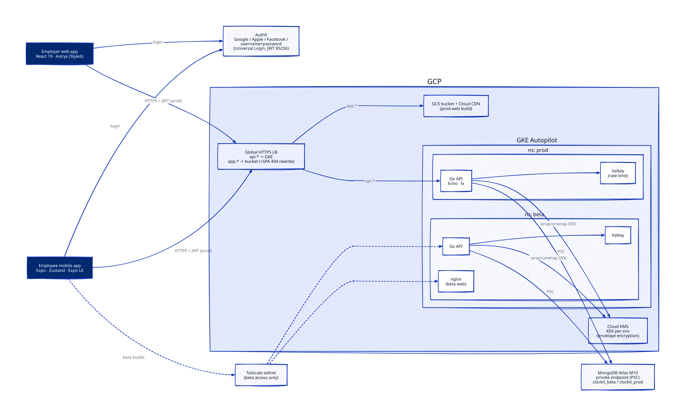

# ClockIt

Employee clock-in/clock-out with server-verified location. Employees clock in from a React Native app; the Go API validates the GPS fix against the employer's anchor before it will open a shift. Employers manage staff from a React web app, review shifts on a week calendar, and split each day's tip pool by hours worked.

Monorepo: **Go API** + **Expo mobile app** + **React web app**, local-first, full OpenTelemetry from the first commit.

> This is an MVP/reference implementation, not the shipped product. Design, code, and infrastructure were developed with AI assistance.



## Engineering highlights

The parts worth reading, with the file that holds them.

**Envelope encryption with crypto-shredding** — a Cloud KMS KEK wraps a per-tenant AES-256-GCM data key; locations, phone numbers, hourly rates and employer anchors are sealed with it. Deleting a user drops their wrapped DEK and every ciphertext they own becomes unrecoverable — that is the entire GDPR delete. Unwrapped keys are cached in-process for 15 minutes, so KMS is hit once per tenant per window, not once per request. `backend/internal/crypto/envelope.go`

**One open shift, enforced by the database** — a partial unique index on `(user_id)` where `status: "open"` makes a concurrent double clock-in a write conflict instead of an application-level race. `backend/internal/mongox/indexes.go:40`

**Offline-first outbox with idempotent replay** — every mobile mutation carries a client-generated UUID and is applied to local state immediately. Failed writes persist to AsyncStorage and flush on reconnect, foreground and cold launch; a unique index on `(user_id, client_id)` makes retries free. `mobile/src/stores/outbox.ts`, `mobile/src/lib/sync.ts`

**Clock-out is deliberately unbounded in the past** — queued clock-ins expire after 72 h, but a close has no past bound at all. Refusing a stale close cannot take back hours the clock-in already put on record; it only strands the shift open, and the one-open-shift index then blocks every future clock-in with no event able to clear it. Accepted-but-old events get a `backdated` flag instead of a rejection. The reasoning, and the limitation it leaves open, are written down in [design §4.5](docs/design.md#45-location--anti-spoofing-rules). `backend/internal/entry/geo.go`, `backend/internal/entry/handler.go:216`

**Anti-spoofing that admits its own ceiling** — mock-location flag, accuracy gate, clock-skew gate, server-side haversine against the anchor, and a speed-anomaly flag on background pings. Coordinates still come from the client, so a rooted device can lie — the design says so out loud and scopes device attestation (Play Integrity / App Attest) as the real fix rather than claiming the gates close it. `backend/internal/entry/geo.go`

**Tip splitting that always sums to the pool** — shares are settled by largest remainder with integer arithmetic throughout, so the cents never drift, and the split is computed on read so editing a tip or a shift can never leave a stale payout behind. `backend/internal/tip/split.go`

**A typed error catalog, not error strings** — one `AppError` per failure mode rendered as `{"error":{code,message,details}}`; both frontends key their UX off the code. `OUT_OF_RANGE` carries the actual distance so the app can say "1.8 km from Acme". `backend/internal/httpx/codes.go`

**Full OpenTelemetry on day one** — traces, metrics and logs over OTLP, using upstream instrumentation for Echo, the Mongo v2 driver, Valkey and the Go runtime, with `slog` bridged so logs carry `trace_id` automatically. `docker compose up` starts `grafana/otel-lgtm`, so local dev exercises the real export path — production only swaps the collector's exporter, never app code. `backend/internal/otelx/`

**Deliberately missing layers** — handlers call stores directly. No service layer, no repository interfaces, no mock generation. Business rules are plain functions with plain table tests. Interfaces are introduced only where a second implementation genuinely exists — the KEK wrapper, which has a KMS one and a local-dev one. Shortcuts taken on purpose are marked with a `ponytail:` comment naming the ceiling and the upgrade path.

## Stack

| Area                            | Technology                                                                                                                                                                   |
| ------------------------------- | ---------------------------------------------------------------------------------------------------------------------------------------------------------------------------- |
| `backend/` — REST API           | Go 1.25, Echo, uber/fx (DI), MongoDB 8, Valkey, Google Cloud KMS, AES-256-GCM, JWT/RS256 (Auth0 JWKS), OpenTelemetry (traces + metrics + logs)                               |
| `mobile/` — employee app        | React Native 0.86, Expo SDK 57, Expo Router, `@expo/ui` (SwiftUI / Jetpack Compose), Zustand, expo-location + expo-task-manager, Auth0                                       |
| `web/` — employer app           | React 19, TypeScript, Vite, Astryx (StyleX), React Router, Google Maps JS API, Auth0                                                                                         |
| `infra/` — cloud infrastructure | GCP (GKE Autopilot, Cloud CDN, Cloud KMS), MongoDB Atlas over Private Service Connect, Cloudflare DNS, Tailscale, OpenTofu, GitHub Actions with Workload Identity Federation |

## Layout

```
backend/     Go API — cmd/{api,seed}, internal/{auth,crypto,employer,entry,tip,user,httpx,mongox,valkeyx,otelx,config}
mobile/      Expo app — src/{app,api,components,lib,location,stores}
web/         React SPA — src/{routes,components,lib}
docs/        design.md (authoritative system design) + D2/SVG diagrams
infra/       OpenTofu stacks + kustomize manifests
```

One package per domain, no barrel files, no re-export hubs.

## Run it locally

Everything runs offline except Auth0. No cloud account needed.

```sh
docker compose up -d            # mongo :27017, valkey :6379, otel-lgtm :3000/:4317/:4318

cd backend && make run          # API on :8080
cd backend && make seed         # demo employer, members, a week of entries

cd web && npm install && npm run dev
cd mobile && npm install && npm run ios      # or: npm run android
```

The mobile app needs a dev build rather than Expo Go — background location and the native Auth0 SDK are not available there. Traces, metrics and logs land in Grafana at `localhost:3000`. Envelope encryption runs the real code path locally — the KEK wrapper swaps to a static dev key, the DEK and ciphertext logic is unchanged.

## Tests and checks

All verified green against the local stack:

```sh
cd backend && make test && make lint    # 198 tests across 10 packages, golangci-lint: 0 issues
cd mobile && npm test                   # 146 tests (node:test)
cd web && npm test                      # 34 tests (vitest)
```

378 tests total. They cover the parts where being wrong costs money or leaks data: geo validation and clock-skew rules, envelope seal/open, tip-split rounding, the outbox state machine and its rehydration gate, rate limiting, and index construction. CI (`.github/workflows/ci.yml`) runs build, test and lint per changed area.

## API

18 JSON routes under `/v1` plus `/healthz`, all bearer-JWT except the health check. Employee routes cover profile, clock-in/out, entry listing, employer assignment and batched background pings; employer routes cover employers, members, rates, entry ranges, daily tips and the payroll report. Hourly rates are never serialized by an employee-facing endpoint.

Full table with request shapes: [design §4.2](docs/design.md#42-api).

## Documentation

- **[System design](docs/design.md)** — the authoritative document: auth, data model, envelope crypto, location rules, tip math, observability, infrastructure, cost, and a decisions log. Includes the limitations that were accepted rather than hidden.
- **Diagrams** — [architecture](docs/diagrams/architecture.svg) · [infrastructure](docs/diagrams/infra.svg) · [clock-in flow](docs/diagrams/clock-in-flow.svg) (D2 sources alongside)
- **[Infrastructure](infra/README.md)** — stack layout, apply order, and the decisions taken while deploying

## Status

Backend, mobile, web and cloud infrastructure are built; the stacks are applied and serving. Remaining before a store release: end-to-end verification on real devices against beta, the tagged prod release pipeline run, and hardening (Play Integrity / App Attest, alerting, backup drill).

## License

[MIT](LICENSE) © Setthasit Thungkawee
